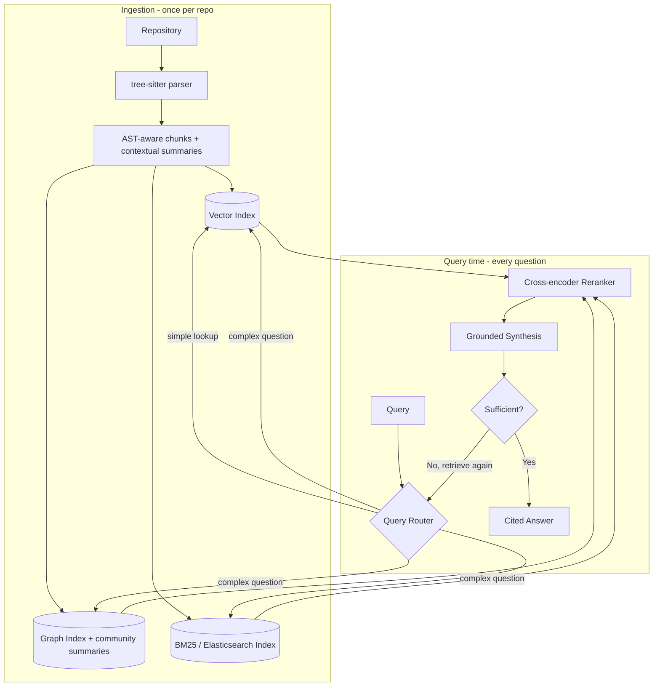

# Kitsune — a general-purpose repository knowledge base system

**Status: Design document. Not yet built.** ArchFox's Phases 1–3 (GitHub PR review, RAG retrieval, multi-agent LangGraph pipeline) are built and working — see [docs/versions/v1.md](../versions/v1.md) through [v4.md](../versions/v4.md). This document lives inside the ArchFox repo for now since there's no code yet, but Kitsune itself is **not** an ArchFox subsystem.

## What is Kitsune

Kitsune is a **standalone system, built from scratch, independent of ArchFox** — the system that lets any AI agent or tool actually understand a codebase, instead of just searching it. ArchFox is Kitsune's *first consumer*, not its owner: ArchFox will call Kitsune the same way it calls Groq or the GitHub API — as an external system with its own interface — not as code living inside ArchFox's own folders.

It replaces flat vector search (what most RAG-over-code systems do, including ArchFox's current `retrieval/` module) with a structured, layered knowledge base combined with **hybrid retrieval**: vector search, keyword search, and graph traversal working together instead of any one alone.

Named after the fox — traditionally depicted with multiple tails, each a separate power. Kitsune's "tails" are its retrieval methods.

## Who this is for

Kitsune isn't scoped to "help ArchFox review PRs better." Anything that needs to answer questions about a codebase is a potential consumer — now or in future projects:

- Code review agents (ArchFox, today)
- Onboarding assistants ("explain how this repo is structured" for a new engineer)
- IDE plugins or chat tools answering "where is X handled in this codebase?"
- Documentation generators
- Issue-investigation agents (ArchFox's own later Phase 5)
- Any future project that needs to reason about a codebase instead of guessing

**Design consequence:** Kitsune needs a clean, stable public interface — something like *index a repo once, then query it many different ways* — rather than a set of internal classes wired only to ArchFox's specific pipeline. It should be buildable, testable, and usable entirely on its own, with ArchFox as one integration among potentially several, not the reason the interface looks the way it does.

## The problem this solves

Plain RAG (what ArchFox currently does — embed chunks, store in Qdrant, search by similarity) has three well-known failure modes at scale, common to most naive RAG-over-code systems, not unique to any one implementation:

1. **Semantic drift** — chunking code by arbitrary boundaries loses the surrounding context. A search for "authentication" can return a chunk with no idea how it's actually wired into the app.
2. **Hallucinated relationships** — asking an LLM to reason about a large codebase in one shot invites it to guess at dependencies and structure it never actually verified.
3. **The context ceiling** — no context window is big enough for a truly large codebase, no matter how cleverly it's chunked.

## The core idea: Concept-Grounded Repository Model

If Kitsune has one original contribution instead of a list of features, this is it: **retrieval should operate on business concepts, not just code symbols.**

Most RAG-for-code systems — including ArchFox's current `retrieval/` module — index and retrieve at the level of files, functions, and chunks. Ask "explain subscriptions" and you get back whatever code chunks happen to contain the word "subscription." Kitsune instead extracts the *concepts* a repository is actually about — Payment, Invoice, Refund, Customer, Coupon, Subscription — as first-class entities, built from code, docstrings, comments, and naming patterns combined, not just symbol names.

Each concept carries structured memory, not just a pointer to source:

```
Authentication
  Purpose: handles login
  Used by: Billing, Profile, Notifications
  Depends on: JWT, Redis, UserService
  Introduced by: <commit/PR that first added it — real git data>
  Last modified: <derived from git history — real git data>
  Risk: critical (many dependents, derived from the dependency graph)
```

Ask "explain subscriptions" and Kitsune retrieves *everything connected to the concept* — its purpose, what depends on it, what it depends on, how and why it entered the codebase — not just functions whose text happens to match. Every other piece of this design (the layers below, hybrid retrieval, the graph, the agents) exists to make this concept-level retrieval accurate and grounded — they're supporting infrastructure for one idea, not independent features bolted on side by side.

## The supporting layers



The top half runs once when a repo is indexed. The bottom half runs fresh per question, and can loop back on itself if the synthesized answer isn't well-grounded enough on the first pass — this is what "agentic retrieval" means in practice, not a single fixed lookup.

### 1. Layered knowledge base, not flat chunks
Instead of one undifferentiated pile of embedded chunks, information is organized in layers an agent reads top-down, drilling deeper only when it needs to:

- **Layer 1 — Ontology**: the map. Business concepts (the entities from the core idea above), folder structure, how systems flow into each other. This layer also generates a **Repository DNA summary** on first index — architecture style (layered, hexagonal, microservices), primary communication pattern (REST, events, RPC), persistence choice, and rough coupling/complexity signals, derived from real static analysis, not guessed. Gives a new consumer an immediate "what kind of codebase is this" answer instead of just "indexed successfully."
- **Layer 2 — Architecture**: the blueprints. Subsystems, data models, cross-module dependencies (ArchFox's existing `RepoAnalyzer` already does a simple version of this).
- **Layer 3 — Implementation**: the details. Deep, per-file documentation.

This mirrors how a human engineer actually orients in an unfamiliar codebase — skim the folder structure and README first, then drill into one module, not the other way around.

### 2. Hybrid retrieval, not one search method
Three retrieval methods, each covering the others' blind spots:

| Method | Finds | Misses |
|---|---|---|
| Vector search (current) | Code that *means* something similar | Exact strings, error messages, variable names |
| BM25 / Elasticsearch | Exact keyword/lexical matches | Semantic similarity when wording differs |
| Graph traversal | What calls what, structural relationships | Anything not explicitly connected in the graph |

A query like "why does this error happen" benefits from all three: BM25 finds the literal error string, vector search finds semantically related handling code elsewhere, graph traversal finds what actually calls the failing function.

### 3. A concept-and-causality graph, not just a call graph
The graph doesn't only connect syntax (`Function A calls Function B`). It connects concepts: `Authentication → protects → Billing → stores → Invoice → uses → Postgres`. And it carries real history alongside structure — who introduced a concept, which PR/issue motivated it, and what would break if it were removed, all mined from actual git blame, commit messages, and PR/issue references, not inferred. This is what lets "explain subscriptions" answer with relationships and provenance, not just a list of matching files.

### 4. Grounded, cited synthesis through named agents
Every claim traces back to a specific file and line — not a plausible-sounding paraphrase. The synthesis pipeline is a set of concretely named roles, not an abstract "multi-agent" label: a **Planner** decomposes the question, a **Retrieval Agent** and **Graph Agent** pull candidates from their respective indexes, an **Evidence Judge** checks whether what came back actually answers the question, a **Synthesizer** drafts the answer, a **Fact Checker** verifies every claim against the retrieved evidence, and a **Citation Generator** attaches real file:line references to the final output. This is the same pattern already proven in ArchFox's Phase 3 (Security/Performance/Testing/Architecture specialists → Judge Agent) — reimplemented here as Kitsune's own synthesis layer so *any* consumer gets grounded, citable answers, not just ArchFox's review flow.

## Advanced techniques from current practice

Researched rather than assumed — these are real, current (2026) techniques in production RAG systems, worth designing in from the start rather than bolting on later:

- **Contextual Retrieval** (a technique published by Anthropic): before embedding, prepend each chunk with a short, LLM-generated note on where it sits in the file and repo — e.g. "this function belongs to `UserService` in `services/user_service.py`, which handles authentication." This directly attacks semantic drift: a chunk carries its own context even when retrieved in isolation, instead of depending on the retriever to also fetch the surrounding chunks.
- **AST-aware chunking with real sizing discipline**: chunk boundaries should follow `tree-sitter`'s parse tree (function/class boundaries) — the same idea ArchFox's own `code_chunker.py` already does in miniature via regex. Production systems typically keep chunks around 100–1000 characters, and attach each chunk's scope chain, imports, and sibling signatures as structured metadata, not just raw text.
- **Cross-encoder reranking**: after hybrid retrieval pulls, say, the top 20 candidates from vector + BM25 + graph combined, a second, more expensive but far more accurate model re-scores just those 20 for actual relevance before the top few go to synthesis. Cheap first pass across everything, expensive second pass only on the shortlist — described in current practice as "the sweet spot of cost vs quality" beyond hybrid retrieval alone.
- **GraphRAG-style community summaries**: instead of only traversing the graph edge by edge, pre-cluster related entities (e.g. every class in an "auth" subsystem) and generate a summary for each cluster ahead of time. This gives Layer 1 (Ontology) a real, automatically generated starting point instead of requiring it to be hand-written.
- **Adaptive routing and an agentic retrieval loop**: not every query needs the full pipeline — a simple factual lookup can be answered from vector search alone, while a complex investigative question (like ArchFox's own future Phase 5, "why is payment failing?") benefits from the full hybrid pipeline, run more than once if the first pass isn't sufficient. This is what the diagram's `Sufficient?` loop represents: retrieve, judge whether it's enough, retrieve again if not, rather than one fixed pass. Cited benchmarks put naive single-pass RAG around 44% accuracy on factual questions, versus 63%+ for pipelines combining techniques like these — a measured gap, not a marginal one.

## What this does **not** claim

Stated plainly, since it matters: this does not eliminate hallucination or context limits — no LLM-based system can. It reduces hallucination by forcing every claim to cite real, retrieved evidence, and it works around context limits by retrieving only the relevant slice at each step instead of dumping everything in at once. The limit is hidden by good retrieval, not removed.

Two more things explicitly out of scope, called out on purpose because they're tempting to add and easy to get wrong:

- **No fabricated confidence scores.** A concept's metadata will never show a number like "Confidence: 98%" unless there's a real, defined calculation behind it (e.g. retrieval score, or agreement across independent sources). An LLM-generated number that looks precise but isn't backed by real measurement is worse than no number at all — it borrows the credibility of statistics without doing the work.
- **No probability-based breakage prediction** (e.g. "78% chance this PR breaks payments"). Structural blast-radius — "these 4 files depend on this function, so changing it touches them" — is real, deterministic, and buildable from the dependency graph today. A calibrated *probability* of an actual failure is a different, much harder problem requiring real historical incident data to train against, which most repositories don't have labeled. Until that data and a real model exist, Kitsune reports structural impact, not a percentage.

## Honest comparison

| | Plain vector RAG (ArchFox today) | Graph-only tools | Kitsune (planned) |
|---|---|---|---|
| Retrieval unit | Code chunk | Code symbol | Business concept, grounded in code |
| Chunking | Arbitrary or function-boundary | N/A | AST-aware, with contextual summaries |
| Retrieval | Vector only | Graph only | Vector + BM25 + graph, adaptively routed |
| Reranking | No | Rare | Cross-encoder reranker on the shortlist |
| Retrieval loop | Single pass | Single pass | Agentic — retries if the answer isn't grounded enough |
| History/causality | No | No | Who introduced it, which PR/issue, from real git data |
| Citations/grounding | Rare | Rare | Required by design |
| Multi-agent synthesis | No | No | Yes, concretely named roles (built in Phase 3, extended here) |

**Versus commercial tools** (CodeRabbit, Cursor, GitHub Copilot): those are production systems built by full teams with years of real-world iteration and evaluation data. Kitsune is a Phase 4 plan for a learning project. Being honest about that isn't a knock on the idea — hybrid retrieval plus an explicit layered knowledge base plus built-in multi-agent synthesis isn't standard in most of those tools today, which is a real technical angle worth pursuing. But it's a hypothesis to prove by building and testing, not a claim to make in a document.

## On becoming something people talk about

No design document makes a project notable — three things actually do: it has to genuinely work on real repositories, better than the alternative, in a way people can verify themselves; it has to be shared publicly (open source, write-ups, demos); and it has to solve a problem people already recognize they have. The most credible path from here is: build Kitsune for real, keep the `docs/versions/` learning log going (which is already a genuine "built in public" story), and open-source it once it's solid enough to withstand outside eyes. This document is a plan to build toward that, not the thing that gets there by itself.

## What's needed to actually build this

- Its own multi-language parser, using `tree-sitter` — not a reuse of ArchFox's Python-only `ast`-based `RepoAnalyzer`, which was built for ArchFox's specific needs, not as a general-purpose component
- **A concept-extraction pipeline** — the core idea's actual engine: identifying business concepts from code symbols, docstrings, comments, and naming patterns, and disambiguating them (this is the hardest, least off-the-shelf piece of the whole design, and the one worth prototyping first)
- **A causality-mining step** over real git history — git blame, commit messages, and PR/issue references, to populate "introduced by," "last modified," and "motivated by" fields with real data, not inference
- Graph database integration (e.g. Neo4j) for structural relationships *and* concept-to-concept relationships
- BM25/Elasticsearch integration for lexical search
- Layer-generation pipeline for the 3-layer knowledge base, including automatic community summaries for Layer 1 (GraphRAG-style clustering, not hand-written) and the Repository DNA summary
- A contextual-retrieval step that attaches a short generated note to each chunk before embedding
- A cross-encoder reranker for the post-retrieval shortlist
- A query router that matches simple queries to a fast single-method lookup and complex ones to the full hybrid pipeline, with a retry loop if the synthesized answer isn't sufficiently grounded
- The named agent roles (Planner, Retrieval Agent, Graph Agent, Evidence Judge, Synthesizer, Fact Checker, Citation Generator) as real, separate implementations — not just a label
- Citation/grounding enforcement built into every synthesized answer, not just one consumer's flow
- **A stable public interface** — index/query methods (or an API, if run as a service) that any consumer project can call, versioned independently of ArchFox's own release cycle
- A decision on distribution: a standalone installable package (e.g. `pip install kitsune-kb`) versus a hosted service ArchFox and future projects call over a network — worth deciding deliberately when this is actually built, not assumed now

## Status

Design only. Nothing in this document is implemented yet. Revisit when Phase 3 work is fully wrapped and there's deliberate time to start Phase 4 — see the project's established pace: build incrementally, test each piece, don't jump ahead before the current phase feels solid.

## Sources

The "Advanced techniques" section above is based on current (2026) research and production practice, not assumption:

- [Advanced RAG techniques for high-performance LLM applications](https://neo4j.com/blog/genai/advanced-rag-techniques/) — Neo4j, on hybrid retrieval, reranking, and Contextual Retrieval
- [12 Advanced RAG Techniques: Beyond Naive Retrieval](https://atlan.com/know/advanced-rag-techniques/) — Atlan, covering RAPTOR, Self-RAG, GraphRAG, and adaptive routing, including the 44%-vs-63% accuracy benchmark
- [Agentic Retrieval-Augmented Generation: A Survey on Agentic RAG](https://arxiv.org/pdf/2501.09136) — survey on the retrieve-judge-retry loop pattern
- [GitHub: sarabesh/HybridRAG](https://github.com/sarabesh/HybridRAG) — a working reference implementation combining vector and Neo4j graph search
- [Building Real-Time Semantic Code Search With Tree-sitter and Vector Embeddings](https://pub.towardsai.net/building-real-time-semantic-code-search-with-tree-sitter-and-vector-embeddings-b9b1fc0a94f3) — Towards AI, on AST-aware chunking practice
- [cAST: Enhancing Code Retrieval-Augmented Generation with Structural Chunking via Abstract Syntax Tree](https://arxiv.org/html/2506.15655v1) — research on AST-based chunk sizing
- [GitHub: supermemoryai/code-chunk](https://github.com/supermemoryai/code-chunk) — a working reference implementation of AST-aware code chunking
