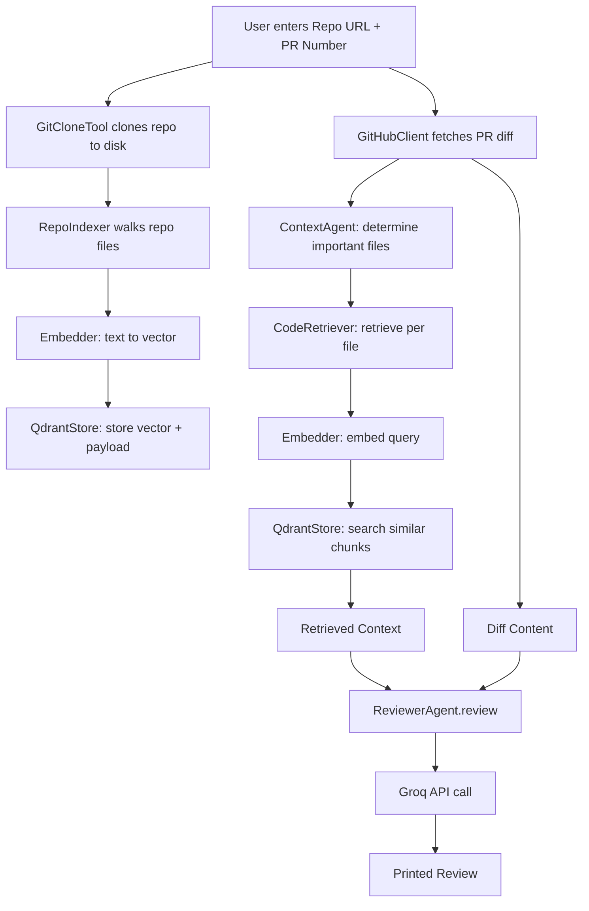

# v3 — RAG retrieval pipeline

## What was built
The reviewer stopped only looking at the diff, and started looking at the rest of the codebase too — Retrieval-Augmented Generation (RAG).

## Flow diagram

The top branch (A → E) is the **indexing** phase — it fills Qdrant with searchable code before any review happens. The bottom branch (A → F → K) is the **retrieval** phase — it happens fresh for every PR. Both branches feed into `ReviewerAgent.review()` at the end.

- `retrieval/embeddings/embedder.py` — `Embedder`, using a local `sentence-transformers` model (`BAAI/bge-small-en-v1.5`) to turn text into vectors, no external API needed.
- `retrieval/vectorstore/qdrant_client.py` — `QdrantStore`, a local (embedded, file-based) Qdrant vector database for storing and searching those vectors.
- `retrieval/indexer/repo_indexer.py` — `RepoIndexer`, walks a cloned repo, chunks each file's text, embeds each chunk, stores it in Qdrant.
- `retrieval/retriever/code_retriever.py` — `CodeRetriever`, embeds a query and searches Qdrant for the closest matching chunks.
- `agents/retrieval/context_agent.py` — `ContextAgent`, orchestrates the flow: determine important files from the PR → retrieve related context → send diff + context to the reviewer.
- `tools/git/git_clone.py` — `GitCloneTool`, clones a repo locally (via GitPython) so it can be indexed.
- `prompts/review_prompt.py` — `build_review_prompt()`, formats the diff and retrieved context into one prompt.
- `apps/cli/main.py` — now clones, indexes, retrieves, and reviews in one run.

## Key files touched
All of the above, plus `pyproject.toml` (added `sentence-transformers`, `gitpython`, `qdrant-client`, `tqdm`).

## Bugs hit and fixed
- **Qdrant lock conflict**: `RepoIndexer` and `CodeRetriever` each created their own `QdrantStore`, but Qdrant's local (file-based) mode only allows one open connection to the storage folder at a time. Fixed by creating a single `QdrantStore` in `main.py` and passing it into both.
- **`qdrant-client` API change**: the installed version (1.18.0) removed the old `.search()` method in favor of `.query_points()` — a library version mismatch, not a code logic bug. Fixed inside `QdrantStore.search()`, without changing anything that calls it.
- **Missing `__init__.py` files**: several package folders lost their marker files, which broke the installed `archfox` command (it needs real packages) even though `python -m apps.cli.main` kept working (it tolerates "namespace packages" without `__init__.py`).

## What I learned
- What RAG (Retrieval-Augmented Generation) means in practice: embed text → store vectors → search by similarity → feed results back into the AI prompt.
- What an embedding is: a list of numbers representing meaning, where similar text produces similar numbers.
- The difference between a vector database running as a separate server vs. running "embedded" (local files, like Qdrant's `path=` mode or Chroma) — and the tradeoff (embedded is simpler, but only one process can use it at a time).
- Why sharing one instance of a resource (dependency injection) matters when that resource holds an exclusive lock.
- Library APIs change between versions — always check the actual installed version when something that "should" work doesn't.
