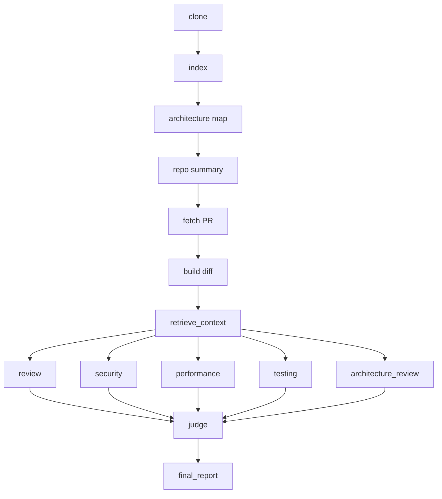

# v4 — Multi-agent LangGraph pipeline (Phase 3 complete)

## What was built
The entire pipeline became one real LangGraph graph, and the single reviewer became five specialist agents feeding into a synthesizer — completing Phase 3 of the roadmap exactly as originally diagrammed (Security, Performance, Testing, Architecture agents → Judge Agent).

- **Whole pipeline as one graph**: clone, index, architecture map, summary, fetch PR, build diff, retrieve context, and review all became nodes in a single `StateGraph`. `apps/cli/main.py` shrank from 64 lines doing 8 things directly to ~30 lines that just build the initial state and call `graph.invoke(...)` once.
- **Four new specialist agents**, each with its own narrow prompt (ignore everything except its one concern) and its own file: `SecurityAgent`, `PerformanceAgent`, `TestingAgent`, `ArchitectureAgent` — all running in **parallel**, fanned out from the same `retrieve_context` node.
- **`JudgeAgent`** — reads all five specialist outputs (general review + 4 narrow findings) and produces one final, deduplicated, prioritized report with an actual verdict, instead of just printing five separate blocks of text.
- **Flat `agents/` folder** — no per-agent subfolders, just `agents/reviewer_agent.py`, `security_agent.py`, `performance_agent.py`, `testing_agent.py`, `architecture_agent.py`, `judge_agent.py`.
- **Consolidated `graphs/` folder** — `state.py` (the one `PipelineState` shape), `nodes.py` (every node function), `pipeline_graph.py` (wires them together).

## Flow diagram

Everything before `retrieve_context` is sequential (each step needs the last). From `retrieve_context` onward, five agents run independently off the same context, then all five feed into `judge`, which is the only node LangGraph waits on all five predecessors for.

## Key files touched
`apps/cli/main.py`, `graphs/state.py`, `graphs/nodes.py`, `graphs/pipeline_graph.py`, `agents/reviewer_agent.py`, `agents/security_agent.py`, `agents/performance_agent.py`, `agents/testing_agent.py`, `agents/architecture_agent.py`, `agents/judge_agent.py`, `prompts/security_prompt.py`, `prompts/performance_prompt.py`, `prompts/testing_prompt.py`, `prompts/architecture_prompt.py`, `prompts/judge_prompt.py`. Deleted: `agents/retrieval/context_agent.py` (its job got absorbed into graph nodes), the old nested `agents/reviewer/` and `agents/security/` folder attempts.

## Bugs hit and fixed
- **`agents/__init__.py` kept disappearing** — the same recurring pattern from earlier in the project. Recreated each time it was needed.
- **`ReviewerAgent` originally had a `review_security()` method bolted onto it** — wrong home for that logic. Extracted into its own `SecurityAgent` class once a second specialist made the mismatch obvious.
- **Misleading method name**: `SecurityAgent.review()` was renamed to `.analyze()` — "review" was already claimed by `ReviewerAgent`'s actual review, and a narrow specialist doing one check isn't really "reviewing."

## What I learned
- How LangGraph fan-out/fan-in actually works: multiple `add_edge(X, ...)` calls from the same node run in **parallel**; multiple `add_edge(..., Y)` calls into the same node make Y **wait for all of them** before running.
- Why a fixed, hand-wired graph (deterministic, same steps every run) is the right tool here, versus `deepagents`-style dynamic sub-agent delegation (an LLM deciding its own path) — the difference matters, and this phase didn't need the dynamic version.
- Why splitting specialized agents into separate classes/files earns its cost as soon as there's more than one — a single class doing two unrelated jobs is a naming and readability problem, not just a file-organization one.
- A synthesis/judge step is genuinely different from just running multiple agents — it has to actually deduplicate and prioritize, not just concatenate everyone's output.
