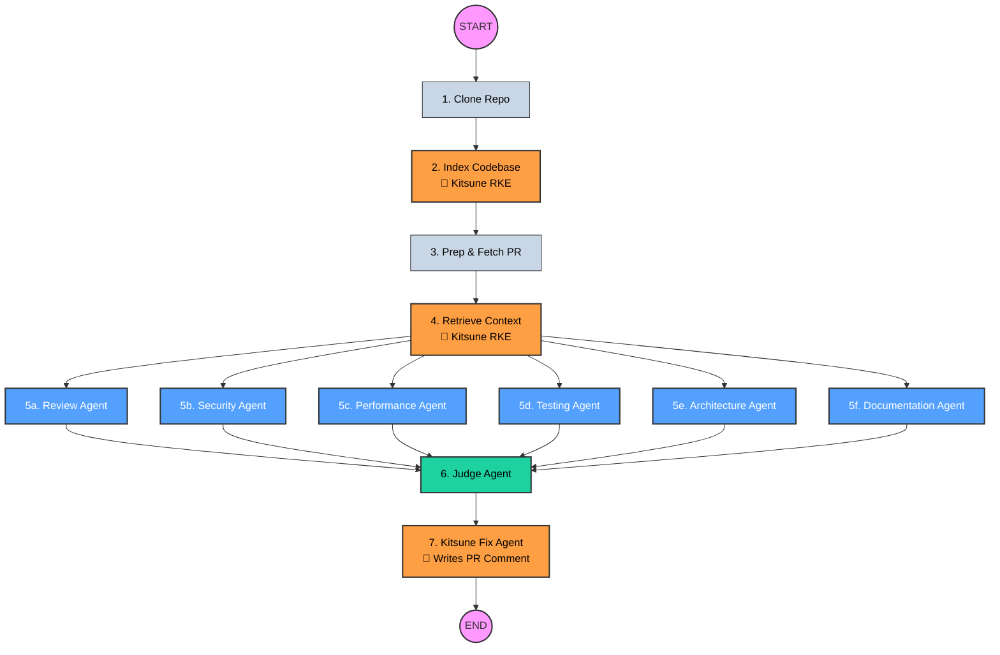

# v6 — The CI/CD Automation (The Autonomous Engineer)

If you are feeling lost, don't worry! ArchFox has grown very fast. This document explains **exactly** how ArchFox works from start to finish as of version 6.

ArchFox is no longer just a code reviewer. Thanks to **Kitsune**, it is now a fully autonomous software engineer that can read your repository, understand how all the code connects, review Pull Requests, and actually write the code to fix any bugs it finds.

---

## 🗺️ The Big Picture

When you give ArchFox a GitHub Repository URL and a Pull Request Number (e.g. in `apps/cli/main.py`), it executes a **LangGraph Pipeline**. Think of LangGraph as a conveyor belt. The PR goes onto the conveyor belt, and it moves through 7 major stations.

Here is the entire conveyor belt:

---

## 🚉 The 7 Stations (Step-by-Step)

### Station 1: Clone Repository
**File:** `graphs/nodes.py (clone_node)`
ArchFox downloads the entire codebase from GitHub to your local machine so it can read the files.

### Station 2: Index Codebase (Kitsune RKE Hybrid Graph)
**File:** `kitsune/engine/knowledge_engine.py (index_repository)`
This is the first time Kitsune steps in. Instead of just reading the code like text, Kitsune's **Repository Knowledge Engine (RKE)** parses the code into an AST (Abstract Syntax Tree). 
It puts the text meaning into a Vector Database (**ChromaDB**) and the structural relationships into a Graph Database (**Neo4j**). 
*v6 Update: Kitsune now features a Hybrid Graph Engine. If it is running inside a GitHub Actions runner and the Neo4j container fails or is unavailable, it gracefully falls back to an in-memory NetworkX graph to prevent the pipeline from crashing!*

### Station 3: Prep & Fetch PR
**File:** `graphs/nodes.py (fetch_pr_node, build_diff_node, etc.)`
ArchFox talks to the GitHub API to download the Pull Request you asked it to review. It looks at the **diff** (the specific lines of code the developer changed).

### Station 4: Retrieve Context (Kitsune RKE)
**File:** `kitsune/engine/knowledge_engine.py (search_semantic)`
If a developer changed a `login()` function in the PR, it's dangerous to review that function in isolation. What if `login()` is called by `checkout()`? 
ArchFox asks the Kitsune Engine for context. Kitsune does a **Hybrid GraphRAG Search**—it pulls the `login()` code from ChromaDB, asks Neo4j what calls it, and returns a massive context document containing all the upstream and downstream dependencies that might be broken by the PR!

### Station 5: The Review Agents (Parallel)
**File:** `agents/reviewer_agent.py, security_agent.py, etc.`
ArchFox takes the PR diff and the massive Kitsune context document, and gives it to 6 different AI Agents at the exact same time using the ultra-fast `llama-3.1-8b-instant` model to bypass Groq rate limits:
- **Review Agent:** Looks for logic bugs.
- **Security Agent:** Looks for vulnerabilities.
- **Performance Agent:** Looks for slow code.
- **Testing Agent:** Looks for missing unit tests.
- **Architecture Agent:** Checks if the code violates design patterns.
- **Documentation Agent:** (New in v6) Checks for missing docstrings and vague comments.
They all work independently and write their own reports.

### Station 6: The Judge Agent
**File:** `agents/judge_agent.py`
The Judge Agent acts as the boss. It reads all 6 reports from the review agents, filters out the false positives, and combines them into one single **Final Report** detailing exactly what is wrong with the Pull Request.

### Station 7: Kitsune Fix Agent
**File:** `agents/fix_agent.py`
This is the magic step. The Judge hands its Final Report to Kitsune. Kitsune says: "Okay, you found bugs. I'm going to write the code to fix them." 
Kitsune uses its own internal LLM to generate the exact git patch/code diff required to fix the bugs. Then, it uses the `GitHubClient` to **automatically post the fix as a comment directly on the GitHub Pull Request** for the human developer to merge.

---

## 🛠️ Where does Kitsune live?
Kitsune used to be an external project, but it is now physically bundled *inside* ArchFox.
- **`ArchFox/kitsune/`**: Contains the core logic for the ChromaDB Vector database and Neo4j Graph database.
- **`ArchFox/kitsune/engine/knowledge_engine.py`**: This is the clean Python API that ArchFox uses to talk to Kitsune (Stations 2 and 4).
- **`ArchFox/agents/fix_agent.py`**: This is the ArchFox wrapper that triggers Kitsune to generate the final code fix (Station 7).
